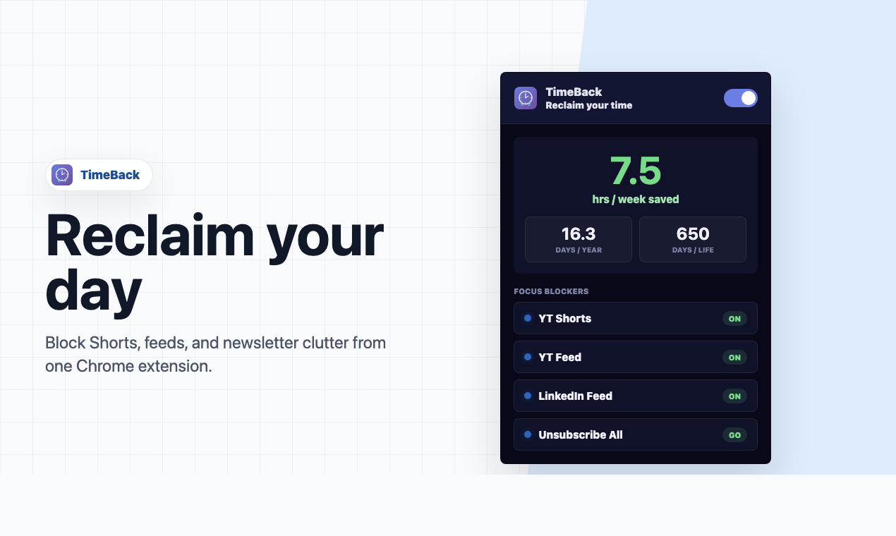
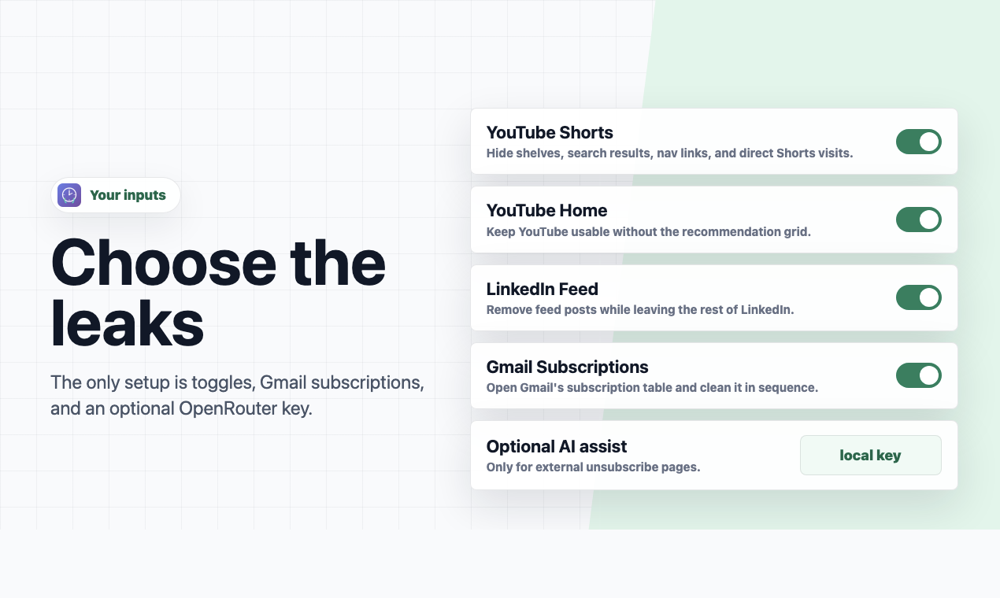
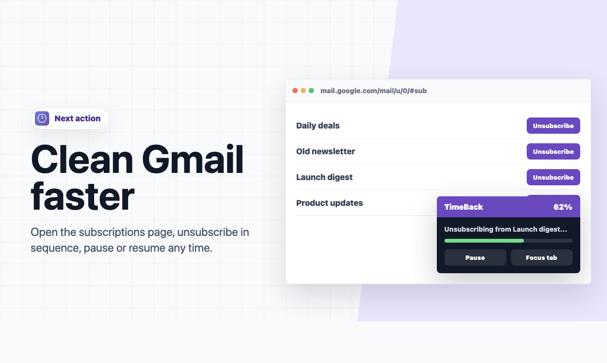
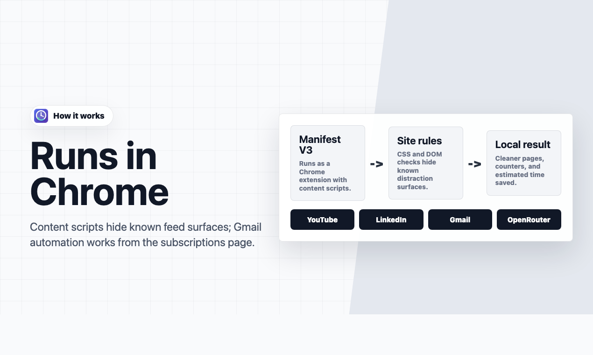
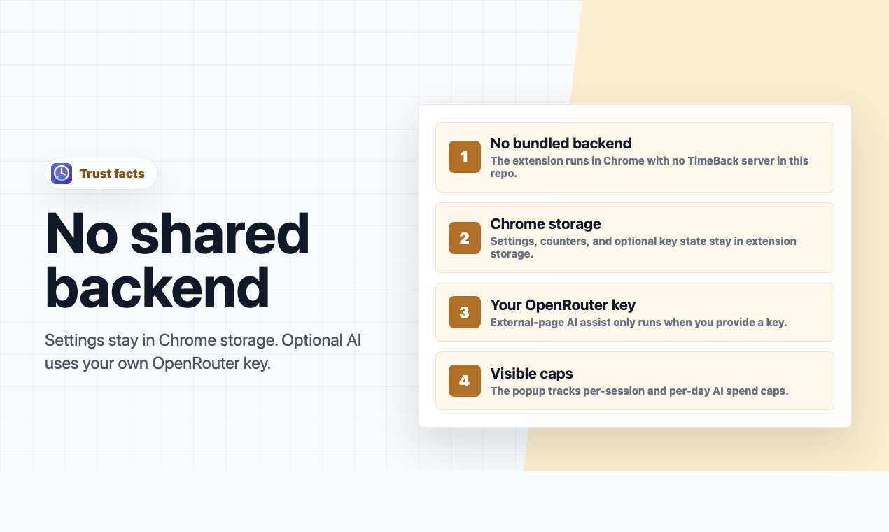

<p align="center">
  
</p>

# TimeBack

Block Shorts, feeds, and newsletter clutter from Chrome.

TimeBack is an open-source Chrome extension for reclaiming attention from the
small loops that quietly drain the day: YouTube Shorts, YouTube Home, LinkedIn
feed posts, and Gmail subscriptions.



## Why It Exists

Most focus tools ask you to block whole sites. TimeBack is narrower: it removes
the distracting surfaces while leaving the useful parts of the web available.
Search YouTube without the Home feed, use LinkedIn without the feed, and clean
Gmail subscriptions without clicking every sender by hand.

## Features

- Blocks YouTube Shorts shelves, search results, navigation links, and direct
  `/shorts/` visits.
- Optionally hides the YouTube Home recommendation feed.
- Hides LinkedIn feed posts while leaving the rest of LinkedIn available.
- Opens Gmail's subscriptions page and unsubscribes from visible subscription
  rows in sequence.
- Includes pause and resume controls for Gmail cleanup.
- Optionally uses your own OpenRouter API key for external unsubscribe pages.
- Shows local counters and estimated time saved.

## Preview

| Choose the blockers | Clean Gmail faster |
| --- | --- |
|  |  |

| Runs in Chrome | Clear trust model |
| --- | --- |
|  |  |

## Install Locally

1. Clone this repository.
2. Open `chrome://extensions` in Chrome.
3. Turn on `Developer mode`.
4. Click `Load unpacked`.
5. Select this `TimeBack` folder.
6. Pin the extension and open the popup.

There is no package install, build command, or bundled backend.

## Usage

Use the master toggle to turn all focus blockers on or off. Each pill controls
one surface: YouTube Shorts, YouTube Home, or LinkedIn Feed.

Click `Unsubscribe All` to open Gmail's subscriptions page. TimeBack waits for
Gmail to load the subscription table, then clicks each unsubscribe action one at
a time. The Gmail overlay and extension popup both expose pause and resume.

The OpenRouter field is optional. It is only needed when a sender opens an
external unsubscribe page outside Gmail and you want TimeBack to ask a model
which safe confirmation action to click.

## Privacy And Trust

TimeBack does not include a TimeBack server or bundled API key.

- Focus settings are stored in `chrome.storage.sync`.
- Counters, Gmail unsubscribe results, AI usage totals, and the optional
  OpenRouter key are stored in `chrome.storage.local`.
- YouTube and LinkedIn blocking is done with local CSS rules and DOM checks.
- Gmail cleanup runs in the Gmail tab.
- Optional off-site unsubscribe assistance sends the external page URL, title,
  visible text, and clickable action candidates to OpenRouter using your key.

See [PRIVACY.md](PRIVACY.md) for the full data-handling summary and
[SECURITY.md](SECURITY.md) for reporting guidance.

## Permissions

| Permission | Why TimeBack Uses It |
| --- | --- |
| `storage` | Saves blocker settings, counters, unsubscribe results, optional OpenRouter key, and AI usage caps. |
| `tabs` | Opens and focuses the Gmail subscriptions tab and sends status between the popup and content scripts. |
| `https://www.youtube.com/*` | Hides Shorts and Home recommendations on YouTube. |
| `https://www.linkedin.com/*` | Hides LinkedIn feed posts. |
| `https://mail.google.com/*` | Runs Gmail subscription cleanup. |
| `https://openrouter.ai/*` | Calls OpenRouter only when optional off-site unsubscribe assistance is enabled. |
| `<all_urls>` | Detects external unsubscribe pages opened from Gmail; the helper returns early unless the page looks like an unsubscribe flow. |

## Product Hunt Assets

Launch copy, gallery planning, source HTML, and PNG exports are included so the
launch can be reproduced from the repository.

| Asset | Path |
| --- | --- |
| Launch kit copy | `marketing/product-hunt/product-hunt-launch-kit.md` |
| Gallery plan | `marketing/product-hunt/gallery-plan.md` |
| Render source | `marketing/product-hunt/slides.html` |
| Export script | `marketing/product-hunt/export-product-hunt-media.sh` |
| Gallery PNGs | `public/product-hunt/gallery-01-hero.png` through `gallery-08-outcomes.png` |
| Thumbnail | `public/product-hunt/thumbnail.png` |

Regenerate the Product Hunt images with:

```bash
bash marketing/product-hunt/export-product-hunt-media.sh
```

The gallery exports are `1270 x 760` PNGs and the thumbnail is a square
`240 x 240` PNG.

## Project Structure

```text
manifest.json       Chrome extension manifest
background.js       Service worker for Gmail tab tracking
popup.html          Extension popup markup
popup.css           Extension popup styles
popup.js            Popup state, settings, stats, and key controls
youtube.js          YouTube Shorts and Home blocker
linkedin.js         LinkedIn feed blocker
gmail.js            Gmail subscription cleanup automation
unsubscribe.js      Optional off-site unsubscribe assistant
icons/              Extension icons
marketing/          Product Hunt launch kit and export source
public/product-hunt Exported Product Hunt PNG assets
```

## Pre-Publish Checks

Useful checks before publishing or packing the extension:

```bash
git status --short
git diff --check
sips -g pixelWidth -g pixelHeight icons/*.png public/product-hunt/*.png
```

Run your preferred secret scanner before publishing a release archive.

## License

MIT. See [LICENSE](LICENSE).
